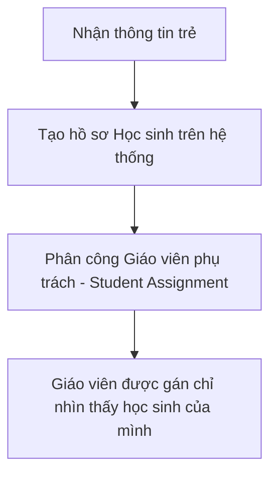
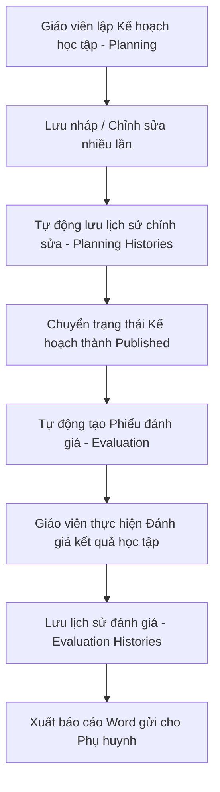

# HƯỚNG DẪN DỰ ÁN BƯỚC CHÂN NHỎ (PROJECT GUIDE)

Tài liệu này được biên soạn nhằm giúp cả khách hàng/người dùng nghiệp vụ (không có nền tảng IT) và lập trình viên (Dev) có thể dễ dàng hiểu được cấu trúc, các quy trình nghiệp vụ và cách dự án hoạt động để bắt đầu làm việc ngay lập tức.

---

## PHẦN 1: DÀNH CHO KHÁCH HÀNG & NGƯỜI DÙNG NGHIỆP VỤ (CLIENT)
*Dành cho người không hiểu về IT, quản lý trung tâm, giáo viên hoặc đối tác sử dụng phần mềm.*

### 1. Giới thiệu chung về Dự án
Dự án **Bước Chân Nhỏ** là một hệ thống quản lý giáo dục chuyên biệt dành cho trẻ em (đặc biệt là trẻ chuyên biệt/can thiệp). Giao diện trực quan được xây dựng trên nền tảng Filament giúp quản lý thông tin học sinh, phân công giáo viên phụ trách, lập kế hoạch giáo dục cá nhân, đánh giá sự tiến bộ của trẻ, quản lý cơ sở vật chất (kho học cụ), kiểm kê định kỳ và theo dõi tiến độ nộp bài của toàn bộ cơ sở.

### 2. Các phân hệ nghiệp vụ chính (Feature Modules)
Hệ thống bao gồm các nhóm chức năng chính được hiển thị trên thanh menu bên trái (Sidebar) của màn hình quản trị:

| Phân hệ (Menu) | Chức năng chính | Đối tượng tương tác |
| :--- | :--- | :--- |
| **Quản lý học sinh (Student)** | Lưu trữ hồ sơ học sinh, thông tin gia đình (bố mẹ, số điện thoại), trạng thái học tập (Đang học / Dừng học). | Admin, Giáo viên |
| **Quản lý giáo viên (Employee)** | Quản lý danh sách giáo viên/nhân viên, thông tin liên lạc, chức vụ, loại hợp đồng (Toàn thời gian, Bán thời gian, Thực tập...). | Admin |
| **Kế hoạch học tập (Planning)** | Lập kế hoạch giáo dục cá nhân cho từng trẻ theo từng khoảng thời gian (Start date - End date), chi tiết mục tiêu dạy học. | Giáo viên, Admin |
| **Đánh giá học tập (Evaluation)** | Đánh giá kết quả của trẻ dựa trên các mục tiêu đã đặt ra trong kế hoạch học tập. | Giáo viên, Admin |
| **Quản lý học cụ (Equipment)** | Quản lý kho giáo cụ, thiết bị dạy học: số lượng, trạng thái (Tốt, Hỏng, Mất), vị trí lưu trữ trong trung tâm. | Admin, Giáo viên |
| **Vai trò & Phân quyền (ACL)** | Quản trị viên phân quyền cho giáo viên, quản lý quyền hạn chi tiết trên từng chức năng. | Admin |

---

### 3. Quy trình Nghiệp vụ & Luồng hoạt động (User Flow)

#### Luồng 1: Tiếp nhận Học sinh & Phân công Giáo viên phụ trách

1. **Đăng ký học sinh**: Khi một trẻ mới nhập học, quản trị viên sẽ tạo hồ sơ học sinh mới, bao gồm tên, biệt danh, ngày sinh, ảnh đại diện, thông tin liên hệ của bố mẹ.
2. **Phân công phụ trách (Assignment)**: Admin tiến hành phân công một hoặc nhiều giáo viên phụ trách chuyên môn cho trẻ.
   * *Đặc điểm phân quyền*: Một giáo viên thông thường chỉ có quyền xem thông tin và soạn kế hoạch cho những trẻ mình được phân công phụ trách. Chỉ Admin hoặc người có quyền `view_all` mới có thể nhìn thấy toàn bộ học sinh trên hệ thống.

#### Luồng 2: Lập Kế hoạch & Đánh giá Giáo dục cá nhân
Đây là luồng cốt lõi của hệ thống giúp theo dõi chương trình học của trẻ.



1. **Soạn kế hoạch (Planning)**:
   * Giáo viên chọn học sinh phụ trách, chọn khoảng thời gian áp dụng kế hoạch (thường là theo tháng hoặc kỳ học).
   * Giáo viên thêm các **Lĩnh vực phát triển** (ví dụ: Ngôn ngữ, Vận động thô, Vận động tinh...) và các **Mục tiêu chi tiết** tương ứng.
   * **Lịch sử Kế hoạch (Planning History)**: Mỗi lần giáo viên bấm lưu kế hoạch, hệ thống tự động chụp lại một bản sao (snapshot). Việc này giúp trung tâm theo dõi được giáo viên đã chỉnh sửa nội dung gì, vào lúc nào.
2. **Kích hoạt Đánh giá (Evaluation)**:
   * Khi kế hoạch soạn xong và được chuyển trạng thái sang **Công bố (Published)**, hệ thống sẽ tự động kích hoạt tính năng **Đánh giá**.
   * Hệ thống sẽ tự động sao chép các thông tin Lĩnh vực và Mục tiêu từ Kế hoạch sang một phiếu Đánh giá mới tương ứng (`Evaluation::upsertFromPlanning`).
3. **Thực hiện Đánh giá**:
   * Giáo viên tiến hành đánh giá từng mục tiêu học tập của trẻ với 3 mức độ:
     * `+` : Đạt / Hoàn thành tốt.
     * `+/-` : Đang tiến bộ / Đạt một phần.
     * `-` : Chưa đạt.
   * Giáo viên ghi thêm nhận xét chi tiết cho từng mục tiêu hoặc lĩnh vực.
   * Tương tự kế hoạch, hệ thống cũng lưu lại lịch sử thay đổi (Evaluation History) mỗi khi lưu đánh giá.

#### Luồng 3: Xuất tài liệu Word gửi Phụ huynh (Export Word)
Hệ thống hỗ trợ xuất file Word trực tiếp từ hệ thống theo mẫu chuẩn của trung tâm:
* **Xuất kế hoạch**: Tải xuống file kế hoạch học tập cá nhân (`template_KHGDCN.docx`) có bảng biểu rõ ràng, các nội dung in đậm, in nghiêng (được chuyển đổi từ định dạng Markdown mà giáo viên nhập trên hệ thống).
* **Xuất đánh giá**: Chỉ hiển thị nút xuất khi phiếu đánh giá ở trạng thái **Công bố (Published)**. Tải xuống file kết quả đánh giá (`template_KQDG.docx`). Hệ thống tự động gộp (merge) các dòng cùng lĩnh vực giúp tài liệu hiển thị đẹp mắt, trực quan nhất.

#### Luồng 4: Báo cáo giám sát nộp bài (Planning/Evaluation Tracker)
Để quản lý trung tâm biết giáo viên nào đã hoàn thành kế hoạch/đánh giá cho học sinh của mình trong tháng:
* Hệ thống cung cấp trang **Giám sát nộp bài (Tracker)**.
* Hiển thị danh sách tất cả học sinh đang hoạt động.
* Cột trạng thái sẽ tự động quét và báo **Đã nộp** (màu xanh) hoặc **Chưa nộp** (màu đỏ) Kế hoạch hoặc Đánh giá trong phạm vi thời gian (thường là tháng hiện tại).
* Admin có thể lọc theo giáo viên phụ trách hoặc xuất dữ liệu báo cáo ra file Excel.

#### Luồng 5: Quản lý & Kiểm kho Học cụ (Equipment & Inventory)
Học cụ giảng dạy rất quan trọng và dễ bị thất lạc hoặc hỏng hóc, luồng này giúp tối ưu hóa việc quản lý:
1. **Quản lý danh mục & Học cụ**: Định nghĩa các danh mục giáo cụ (ví dụ: Đồ chơi vận động, Giáo cụ Montessori...) và tạo mới giáo cụ kèm hình ảnh, vị trí cất giữ, số lượng ban đầu và đơn vị tính.
2. **Kiểm kê định kỳ (Inventory Workflow)**:
   * Admin tạo một **Phiếu kiểm kê mới** (Trạng thái ban đầu: **Nháp - Draft**).
   * Phiếu kiểm kê tự động liệt kê toàn bộ giáo cụ hiện có trong kho kèm theo số lượng lý thuyết đang lưu trên máy tính (Quantity Expected).
   * Giáo viên/Người kiểm kho đi kiểm tra thực tế và điền số lượng đếm được thực tế (Quantity Actual) trực tiếp vào bảng trên hệ thống, kèm theo trạng thái giáo cụ tại thời điểm đó (Tốt, Hỏng, Mất tích) và ghi chú.
   * Đổi trạng thái sang **Hoàn thành (Completed)** để báo cáo kiểm kho xong.
   * Admin xem lại phiếu kiểm kho, nếu chính xác thì bấm **Duyệt phiếu (Approved)**. Lúc này, hệ thống sẽ tự động cập nhật số lượng tồn kho thực tế của giáo cụ trong bảng quản lý học cụ chính dựa trên số liệu thực tế đã kiểm kê.

---

## PHẦN 2: DÀNH CHO LẬP TRÌNH VIÊN (DEVELOPER)
*Dành cho lập trình viên để cấu hình môi trường, hiểu kiến trúc code và bắt đầu phát triển tính năng mới.*

### 1. Công nghệ sử dụng (Technology Stack)
* **Framework**: Laravel 11.x (PHP 8.2+)
* **Admin Panel**: Filament v3 (Hỗ trợ xây dựng giao diện nhanh bằng cấu trúc Form, Table, Relation Manager tiện lợi)
* **Database**: MySQL / MariaDB
* **Testing**: PHPUnit / Pest
* **Code Styler**: Laravel Pint

### 2. Kiến trúc mã nguồn (Modular Package-Driven Architecture)
Dự án này **không** viết code trực tiếp trong thư mục mặc định `app/` (chỉ giữ lại các file cấu hình cốt lõi và AdminPanelProvider).
Tất cả các tính năng nghiệp vụ được tổ chức thành các **Package độc lập** nằm trong thư mục `packages/`.

```
packages/
├── core/                  # Chứa User model, các cấu hình dùng chung toàn hệ thống
├── acl/                   # Phân quyền, Role, Permission (Spatie), Activity Logs
├── employee/              # Quản lý thông tin Giáo viên/Nhân viên
├── student/               # Quản lý hồ sơ Học sinh
├── equipment/             # Quản lý giáo cụ, danh mục giáo cụ, kiểm kho giáo cụ
└── planning_evaluation/   # Lập kế hoạch học tập, Đánh giá, Lịch sử lưu trữ, xuất file Word
```

* **Namespace gốc**: Tất cả các package sử dụng namespace theo quy chuẩn: `Quochao56\<PackageName>`.
  * Ví dụ: Model `Student` nằm ở [Student.php](file:///d:/haolq/laravel/opsgreat/gitlab/buocchannho/packages/student/src/Models/Student.php) có namespace là `Quochao56\Student\Models`.
  * Model `Employee` nằm ở [Employee.php](file:///d:/haolq/laravel/opsgreat/gitlab/buocchannho/packages/employee/src/Models/Employee.php) có namespace là `Quochao56\Employee\Models`.
  * Giao diện quản trị Admin được cấu hình nạp các plugin này trong [AdminPanelProvider.php](file:///d:/haolq/laravel/opsgreat/gitlab/buocchannho/app/Providers/Filament/AdminPanelProvider.php).

---

### 3. Tiêu chuẩn viết mã nguồn (Code Standards & Conventions)

#### Quy tắc 1: Cấu trúc thư mục Filament Resource
Để tránh file Resource chính bị quá dài và khó duy trì, dự án bắt buộc tách biệt cấu trúc Form và Table ra các file Schema riêng. **Tuyệt đối không viết inline `form()` và `table()` bên trong file Resource chính.**

Cấu trúc chuẩn của một Resource (Ví dụ: `StudentResource`):
```
packages/student/src/Filament/Resources/StudentResource/
├── StudentResource.php          # Định nghĩa core resource (icon, navigation, pages)
├── Pages/                       # Các trang Create, Edit, List học sinh
│   ├── CreateStudent.php
│   ├── EditStudent.php
│   └── ListStudents.php
├── Schemas/
│   └── StudentForm.php          # Chứa cấu trúc form (các trường nhập liệu)
└── Tables/
    └── StudentTable.php         # Chứa cấu trúc bảng (cột, bộ lọc, hành động)
```

Cách gọi cấu trúc Form và Table trong `StudentResource.php`:
```php
use Quochao56\Student\Filament\Resources\StudentResource\Schemas\StudentForm;
use Quochao56\Student\Filament\Resources\StudentResource\Tables\StudentTable;

public static function form(Schema $schema): Schema
{
    return StudentForm::configure($schema);
}

public static function table(Table $table): Table
{
    return StudentTable::configure($table);
}
```

#### Quy tắc 2: Khai báo import thư viện (`use` statements)
* Tất cả các câu lệnh `use` import thư viện phải được đặt ở trên cùng của file PHP, ngay bên dưới khai báo `namespace`.
* **Không sử dụng inline Fully Qualified Class Names (FQCN)** trong code (ví dụ: tránh dùng `new \Quochao56\Student\Models\Student()`, hãy import `Student` ở trên cùng và gọi `new Student()`).
* Sử dụng bí danh `as` khi import các class trùng tên từ các namespace khác nhau.

#### Quy tắc 3: Quản lý Phân quyền (ACL Permission Management)
Hệ thống sử dụng package Spatie Permission để phân quyền, tuy nhiên danh sách quyền được khai báo tập trung trong file cấu hình thay vì viết tay vào DB Seeders.

* Địa chỉ khai báo: [permissions.php](file:///d:/haolq/laravel/opsgreat/gitlab/buocchannho/packages/acl/config/permissions.php).
* Khi cần thêm quyền mới (ví dụ cho một phân hệ mới):
  1. Mở file `packages/acl/config/permissions.php` ra.
  2. Thêm nhóm quyền mới vào mảng theo mẫu:
     ```php
     'ten_nhom' => [
         'label' => 'Tên hiển thị nhóm quyền',
         'icon' => 'heroicon-o-key',
         'permissions' => [
             'index' => 'Xem danh sách',
             'create' => 'Thêm mới',
             'edit' => 'Chỉnh sửa',
             'destroy' => 'Xóa',
         ],
     ]
     ```
  3. Đồng bộ quyền vào Cơ sở dữ liệu: Chạy lệnh seed sau để cập nhật tự động (nó sẽ tạo quyền mới trong DB và xóa những quyền không còn được định nghĩa trong cấu hình):
     ```bash
     php artisan db:seed --class=RolesAndPermissionsSeeder
     ```

#### Quy tắc 4: Ngôn ngữ và Dịch thuật (Localization)
* **Không tạo, duy trì hoặc cập nhật bất kỳ file dịch tiếng Anh nào (`lang/en`).**
* **Chỉ viết và cập nhật file dịch tiếng Việt (`lang/vi`)**.
* Mọi chuỗi ký tự hiển thị trên giao diện (UI), nhãn (label), thông báo lỗi hoặc xác thực dữ liệu phải được gọi thông qua hàm dịch `trans()` hoặc `__()` kết hợp với file ngôn ngữ tiếng Việt của từng package.

#### Quy tắc 5: Đảm bảo phong cách Code (Format code)
Trước khi commit code hoặc gửi PR, bạn phải chạy lệnh định dạng code tự động Laravel Pint để đảm bảo tính nhất quán:
```bash
vendor\bin\pint
```

---

### 4. Hướng dẫn cài đặt dự án cho Dev mới (Setup Guide)

Làm theo các bước sau để thiết lập dự án trên máy cục bộ của bạn:

1. **Clone repository**:
   ```bash
   git clone <repository_url> buocchannho
   cd buocchannho
   ```

2. **Cài đặt các gói phụ thuộc (Composer & NPM)**:
   ```bash
   composer install
   npm install && npm run build
   ```

3. **Cấu hình môi trường**:
   * Nhân bản file mẫu `.env.example` thành `.env`.
   * Cập nhật thông số kết nối Cơ sở dữ liệu trong `.env` (`DB_DATABASE`, `DB_USERNAME`, `DB_PASSWORD`).
   * Tạo khóa ứng dụng:
     ```bash
     php artisan key:generate
     ```

4. **Tạo Cơ sở dữ liệu và dữ liệu mẫu**:
   * Chạy migrations để khởi tạo các bảng:
     ```bash
     php artisan migrate
     ```
   * Chạy hạt giống (seeders) để tạo tài khoản Admin mặc định, thiết lập danh sách vai trò và phân quyền mẫu:
     ```bash
     php artisan db:seed
     ```

5. **Chạy dự án**:
   * Chạy server PHP cục bộ:
     ```bash
     php artisan serve
     ```
   * Truy cập giao diện quản trị tại: `http://127.0.0.1:8000/admin`. Sử dụng tài khoản admin được tạo từ seeder để đăng nhập.

6. **Chạy các bài kiểm thử (Testing)**:
   * Chạy kiểm thử tự động của hệ thống:
     ```bash
     php artisan test
     ```
