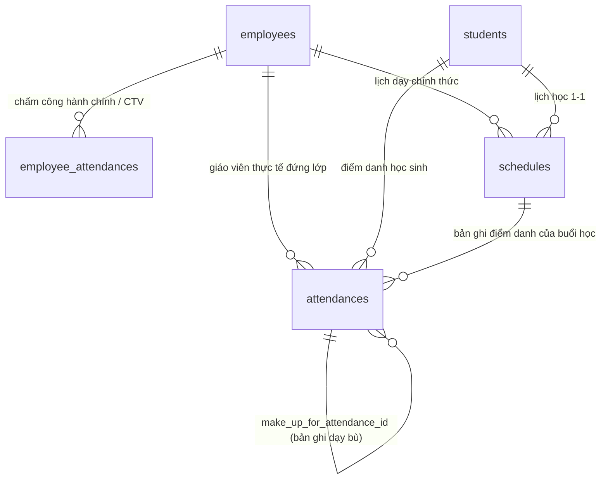

# Kế Hoạch Triển Khai Hệ Thống Chấm Công (Attendance/Timesheet System)

Tài liệu này đề xuất phương án chi tiết để thiết kế và xây dựng **hệ thống Chấm công** dành cho Trung tâm Can thiệp Trẻ đặc biệt. Hệ thống hỗ trợ 3 nhóm đối tượng: Nhân viên hành chính, Giáo viên dạy cá nhân 1-1, và Cộng tác viên (CTV), tích hợp chặt chẽ với các package `scheduler` và `employee` hiện có. 

Đặc biệt, hệ thống sẽ sử dụng plugin **[damodar-bhattarai/filament-settings](https://filamentphp.com/plugins/damodar-bhattarai-settings)** làm nền tảng quản lý các thông số cấu hình hệ thống.

---

## 1. Phân Tích & Làm Rõ Nghiệp Vụ (User Feedback Required)

> [!IMPORTANT]
> **Quy chuẩn UX/UI**: Mobile-first cho phía Nhân sự/Giáo viên/CTV (giao diện dễ tương tác trên màn hình nhỏ) và Desktop/Responsive cho Quản lý/Admin (Dashboard tổng hợp, bảng ma trận chấm công).

### 1.1. Cấu Hình Hệ Thống qua Settings Plugin
Chúng ta sẽ sử dụng thư viện `damodar-bhattarai/filament-settings` để hiển thị trang cài đặt cấu hình trong Admin Panel. Các thông số sau sẽ được định nghĩa:
*   **Giờ hành chính chuẩn**:
    *   `office_morning_start`: Giờ bắt đầu ca sáng (ví dụ: `08:00`).
    *   `office_morning_end`: Giờ kết thúc ca sáng (ví dụ: `12:00`).
    *   `office_afternoon_start`: Giờ bắt đầu ca chiều (ví dụ: `13:30`).
    *   `office_afternoon_end`: Giờ kết thúc ca chiều (ví dụ: `17:30`).
    *   `office_allowed_late_minutes`: Số phút cho phép đi trễ (ví dụ: `15`).
*   **Geofencing (GPS)**:
    *   `center_latitude`: Vĩ độ của trung tâm (ví dụ: `10.776889`).
    *   `center_longitude`: Kinh độ của trung tâm (ví dụ: `106.700806`).
    *   `allowed_radius_meters`: Bán kính cho phép check-in/out mét (ví dụ: `50`).
*   **Xác thực WiFi nội bộ**:
    *   `office_wifi_ips`: Danh sách các địa chỉ IP WAN của mạng WiFi trung tâm (ngăn cách bởi dấu phẩy, dùng làm phương án dự phòng khi lỗi GPS).
*   **Thời gian đệm cho ca dạy (Buffer)**:
    *   `session_checkin_buffer`: Số phút cho phép check-in sớm trước ca học bắt đầu (ví dụ: `15`).
    *   `session_checkout_buffer`: Số phút cho phép check-out trễ sau khi ca học kết thúc (ví dụ: `30`).
*   **Xử lý phiên dở dang (Auto-Close)**:
    *   `auto_checkout_enabled`: boolean – Có tự động đóng phiên check-in khi hết giờ hành chính không (mặc định: `true`).
    *   `auto_checkout_time`: time – Giờ tự động đóng phiên, mặc định bằng `office_afternoon_end` (ví dụ: `17:30`).
    *   `open_session_notify_admin`: boolean – Có gửi thông báo cho Admin khi phiên bị tự động đóng không (mặc định: `true`).

### 1.2. Phân Quyền (Roles & Permissions Mapping)
Đề xuất phân bổ quyền cụ thể dựa trên Spatie Permission tích hợp sẵn trong hệ thống:
*   **Super Admin / Quản lý Trung tâm**:
    *   Toàn quyền cấu hình Settings hệ thống.
    *   Toàn quyền CRUD lịch học (`schedules`), ngoại lệ (`schedule_exceptions`), điểm danh (`attendances`) và chấm công nhân sự (`employee_attendances`).
    *   Xem bảng ma trận chấm công (Grid Timesheet) của toàn bộ nhân viên.
    *   Thực hiện chấm công bù (chỉnh sửa/thêm thủ công log check-in/out) khi nhân viên quên chấm.
    *   Duyệt hoặc từ chối đơn nghỉ phép (`leave_requests`).
    *   Xuất báo cáo chấm công (Excel/PDF).
*   **Giáo viên chính thức (Teacher)**:
    *   Chỉ xem lịch dạy cá nhân/nhóm được phân công phụ trách.
    *   Xem bảng chấm công dạy học cá nhân và lịch sử đi làm của bản thân.
    *   Check-in/Check-out trực tiếp trên ca dạy cá nhân 1-1.
    *   Ghi nhận thông tin học sinh vắng (lý do vắng, người báo vắng).
*   **Cộng tác viên (CTV)**:
    *   Đăng ký khung giờ rảnh (Availability).
    *   Xem lịch dạy được phân công.
    *   Check-in/Check-out ca làm việc trên Mobile.
*   **Nhân viên hành chính (Staff)**:
    *   Chỉ check-in/check-out ca hành chính hàng ngày trên Mobile.
    *   Xem lịch sử chấm công cá nhân.

### 1.3. Xác Thực Vị Trí Check-in (Location Verification)
1.  **Geofencing (GPS + Bán kính)** (Sử dụng `center_latitude`, `center_longitude`, `allowed_radius_meters`).
2.  **Địa chỉ IP / WiFi nội bộ** (Sử dụng `office_wifi_ips`).
3.  **Xử lý ngoại lệ (Sai vị trí)**: Hệ thống vẫn ghi nhận chấm công nhưng gắn cờ cảnh báo: `flagged_location = true`, lưu tọa độ thực tế và hiển thị màu đỏ trên trang quản trị để Admin duyệt thủ công.

### 1.4. Logic Tự Động Khớp Lịch Chấm Công của CTV
1.  CTV bấm check-in tổng quát trên Mobile -> Hệ thống lấy cấu hình đệm `session_checkin_buffer` để quét lịch dạy trong ngày của CTV.
2.  **Trường hợp 1 (Có 1 ca trùng)**: Tự động liên kết log chấm công này vào ca dạy tương ứng.
3.  **Trường hợp 2 (Trùng nhiều ca)**: Hiện popup hỏi CTV lựa chọn ca làm việc.
4.  **Trường hợp 3 (Không trùng ca)**: Lưu log với cờ `unassigned_schedule = true`. Admin sẽ gán thủ công sau.

---

## 2. Kiến Trúc Dữ Liệu & Entity Model Đề Xuất

Sơ đồ liên kết các Model hỗ trợ nghiệp vụ mới:

### 2.1. Cập nhật Model & Migrations

#### A. Package `packages/employee`

##### [MODIFY] [EmployeeAttendance.php](file:///d:/haolq/laravel/opsgreat/gitlab/buocchannho/packages/employee/src/Models/EmployeeAttendance.php)
Thêm các trường phục vụ xác thực vị trí và liên kết CTV:
*   `flagged_location`: boolean, default `false` (Đánh dấu nếu check-in ngoài phạm vi GPS/IP).
*   `unassigned_schedule`: boolean, default `false` (Dành cho CTV check-in ngoài lịch có sẵn).
*   `schedule_id`: foreignKey nullable (Liên kết với bảng `schedules` nếu CTV khớp ca dạy).
*   `verification_status`: string, default `approved` (Trạng thái duyệt: `pending`, `approved`, `rejected` - dùng khi bị gắn cờ sai vị trí).
*   `auto_closed`: boolean, default `false` (Hệ thống tự động đóng phiên khi nhân viên quên check-out).
*   `flagged_missing_checkin`: boolean, default `false` (Check-out tồn tại nhưng không có check-in tương ứng).
*   `corrected_by`: foreignKey nullable → `users.id` (Admin đã duyệt yêu cầu điều chỉnh).
*   `corrected_at`: timestamp nullable (Thời điểm Admin duyệt điều chỉnh).

##### [NEW] AttendanceCorrectionRequest.php (trong package `employee`)
Model mới quản lý các yêu cầu bù/điều chỉnh chấm công do nhân viên gửi lên:
*   `employee_id`: foreignKey.
*   `requested_check_in_at`: datetime nullable.
*   `requested_check_out_at`: datetime nullable.
*   `reason`: text.
*   `status`: enum(`pending`, `approved`, `rejected`), default `pending`.
*   `reviewed_by`: foreignKey nullable → `users.id`.
*   `reviewed_at`: timestamp nullable.
*   `review_note`: text nullable (Lý do từ chối nếu có).

#### B. Package `packages/scheduler`

##### [MODIFY] [Attendance.php](file:///d:/haolq/laravel/opsgreat/gitlab/buocchannho/packages/scheduler/src/Models/Attendance.php)
Thêm liên kết dạy bù và dạy thay:
*   `make_up_for_attendance_id`: foreignKey nullable (Trỏ tới ID của buổi dạy bị hỏng/vắng gốc).
*   `substitute_reason`: string nullable (Lý do dạy thay nếu có).
*   `status`: enum (`present`, `absent_excused`, `absent_unexcused`, `late`, `make_up_pending`, `make_up_completed`).

---

## 3. Quy Trình Nghiệp Vụ Cốt Lõi (Workflows)

### 3.1. Quy trình Học sinh vắng & Dạy bù (Module 2)
1.  Trong ca dạy 1-1, nếu học sinh vắng, giáo viên chọn trạng thái điểm danh: `absent_excused` (Vắng có phép) hoặc `absent_unexcused` (Vắng không phép).
2.  Nếu vắng có phép (`absent_excused`):
    *   Hệ thống hiển thị tùy chọn **"Cần dạy bù"**.
    *   Khi chọn "Cần dạy bù", trạng thái của bản ghi điểm danh hiện tại chuyển thành `make_up_pending`.
    *   Admin hoặc Giáo viên có thể click vào nút **"Tạo buổi dạy bù"** trực tiếp trên bản ghi này.
    *   Bản ghi `Schedule` mới được tạo sẽ có liên kết `make_up_for_attendance_id` trỏ về bản ghi điểm danh cũ.
3.  Khi giáo viên thực hiện dạy và check-out hoàn thành ở buổi dạy bù mới:
    *   Hệ thống tự động cập nhật trạng thái bản ghi điểm danh gốc từ `make_up_pending` sang `make_up_completed` (Đã dạy bù).

### 3.2. Quy trình Dạy thay (Substitute Teaching)
1.  Quản lý tạo `ScheduleException` với hành động `substitute`, chọn `new_employee_id` (Giáo viên dạy thay).
2.  Khi check-in, hệ thống lưu `actual_employee_id` là ID của giáo viên dạy thay. Giáo viên chính thức (`employee_id` từ `schedules`) vẫn được giữ nguyên.

### 3.3. Xử Lý Phiên Check-in Dở Dang (Open Session / Quên Check-out)

Đây là kịch bản nhân viên **check-in hôm trước nhưng quên check-out**, dẫn đến hôm sau vẫn muốn check-in tiếp.

1.  Khi bất kỳ nhân viên nào bấm **Check-in**, hệ thống **bắt buộc kiểm tra** xem có bản ghi `employee_attendances` nào thỏa mãn **đồng thời** 2 điều kiện sau không:
    *   `check_out_at = null` (chưa check-out).
    *   `check_in_at` thuộc **ngày trước đó** (không phải hôm nay).
2.  **Nếu tìm thấy phiên dở dang**:
    a.  Hệ thống **tự động đóng phiên cũ** bằng cách gán `check_out_at = auto_checkout_time` (lấy từ cấu hình Settings) của **ngày check-in cũ đó**.
    b.  Gắn cờ `auto_closed = true` vào bản ghi cũ để phân biệt với checkout thực tế.
    c.  Nếu `open_session_notify_admin = true`: Gửi **Filament Notification** tới tất cả user có quyền `manage_employee_attendances` về phiên vừa được tự động đóng, kèm thông tin nhân viên và ngày giờ.
3.  **Sau khi xử lý xong phiên cũ**: Cho phép tạo bản ghi check-in mới cho ngày hôm nay bình thường.
4.  **Nếu không tìm thấy phiên dở dang**: Tiến hành check-in bình thường.

> [!IMPORTANT]
> Trường hợp đặc biệt: Nếu nhân viên check-in lúc 23:59 và check-out lúc 00:01 hôm sau (ca đêm / tăng ca qua ngày) → cần kiểm tra thêm điều kiện `check_in_at` cách thời điểm hiện tại **> 20 tiếng** mới được tự động đóng, tránh đóng nhầm ca tăng ca hợp lệ.

### 3.4. Tự Động Phát Hiện Vắng Mặt & Quy Trình Bù Chấm Công

#### A. Scheduled Job Cuối Ngày (Detect Absent)
1.  Một **Laravel Scheduled Command** chạy hàng ngày vào lúc `auto_checkout_time` + 5 phút (ví dụ: 17:35).
2.  Command này quét toàn bộ nhân viên hành chính và CTV **đang có lịch làm trong ngày** mà **không có bản ghi `employee_attendances` nào** với `check_in_at` thuộc ngày hôm đó.
3.  Gắn cờ bản ghi vắng mặt (`absent_flag = true`) hoặc tạo bản ghi "absent" để Admin dễ theo dõi trên Bảng Ma Trận.

#### B. Quy Trình Nhân Viên Tự Gửi Yêu Cầu Bù Chấm Công
1.  Nhân viên vào trang **"Lịch sử chấm công cá nhân"** → Click vào ngày bị thiếu hoặc sai → Bấm **"Gửi yêu cầu điều chỉnh"**.
2.  Điền form: Thời gian check-in thực tế, thời gian check-out thực tế, lý do quên chấm.
3.  Hệ thống tạo bản ghi `attendance_correction_requests` với `status = pending`.
4.  Admin nhận thông báo → Duyệt hoặc từ chối → Nếu duyệt, hệ thống tự động cập nhật bản ghi `employee_attendances` tương ứng và ghi nhận `corrected_by` (ID Admin duyệt) + `corrected_at`.

#### C. Trường hợp nhân viên quên check-in nhưng đã check-out
*   Hệ thống cho phép tạo bản ghi với `check_in_at = null` và `check_out_at` có giá trị (check-out đơn thuần mà không có check-in tương ứng).
*   Bản ghi này sẽ tự động bị gắn cờ `flagged_missing_checkin = true` và hiển thị cảnh báo màu vàng trên trang quản trị.

---

## 4. Thiết Kế Giao Diện (UI/UX Mockups & Flow)

### 4.1. Mobile-First Dashboard (Dành cho Giáo viên/Nhân viên/CTV)
*   **Vị trí**: Widget lớn nổi bật ở đầu trang Dashboard của Filament ngay sau khi đăng nhập.
*   **Tự động nhận diện ngữ cảnh (Priority Logic)**:
    1.  *Ưu tiên 1 (Giờ dạy cá nhân/CTV theo lịch)*: Nếu hiện tại đang có ca dạy trong vòng +/- `session_checkin_buffer` phút, hiển thị ca dạy kèm nút **"Check-in Ca Dạy [Tên HS]"**.
    2.  *Ưu tiên 2 (Check-in hành chính)*: Nếu không có ca dạy nào trùng giờ, hiển thị nút **"Check-in Giờ Hành Chính"**.
*   **UI Elements**:
    *   Hiển thị bản đồ mini hoặc trạng thái GPS.
    *   Nút Check-in/Check-out kích thước lớn dạng Gradient nổi bật.

### 4.2. Bảng Ma Trận Chấm Công - Matrix Timesheet (Dành cho Admin)
*   **Giao diện**: Grid Responsive hiển thị danh sách giáo viên/CTV (Cột dọc bên trái) và các ngày trong tháng (Hàng ngang trên cùng).
*   **Tính năng**:
    *   Bộ lọc linh hoạt: Lọc theo Tháng/Tuần/Khoảng ngày tùy chọn.
    *   Click vào ô bất kỳ để mở slide-over chi tiết các log check-in/out trong ngày đó và cho phép **Chấm công bù** (ghi đè dữ liệu thủ công kèm lý do chỉnh sửa).

---

## 5. Kế Hoạch Triển Khai Chi Tiết (Roadmap & Implementation Steps)

### Giai đoạn 1: Cài đặt Thư viện Settings & Migrations
1.  Chạy lệnh cài đặt: `composer require damodar-bhattarai/filament-settings`
2.  Tích hợp `DamodarBhattarai\FilamentSettings\FilamentSettingsPlugin` vào [AdminPanelProvider.php](file:///d:/haolq/laravel/opsgreat/gitlab/buocchannho/app/Providers/Filament/AdminPanelProvider.php).
3.  Cấu hình định nghĩa các trường settings (`office_morning_start`, `center_latitude`, v.v.) trong `config/filament-settings.php` (hoặc thông qua cấu hình của plugin Settings).
4.  Tạo và chạy migration [create_makeup_and_verification_fields_to_tables.php](file:///d:/haolq/laravel/opsgreat/gitlab/buocchannho/database/migrations/2026_07_02_000000_create_makeup_and_verification_fields_to_tables.php) để mở rộng các bảng dữ liệu.

### Giai đoạn 2: Phát triển Backend Logic
1.  Xây dựng class Helper tính toán khoảng cách GPS (haversine formula) so sánh với tọa độ từ cấu hình `settings()`.
2.  Xây dựng logic tự động khớp lịch và đệm thời gian của CTV khi check-in.
3.  Xử lý logic tự động cập nhật trạng thái `make_up_completed` cho buổi dạy gốc khi buổi dạy bù tương ứng được điểm danh thành công.

### Giai đoạn 3: Xây dựng Giao diện (Widgets & Pages)
1.  Phát triển widget check-in mobile-first `MobileCheckinWidget.php`.
2.  Xây dựng trang ma trận chấm công `TimesheetMatrixPage.php` tích hợp bộ lọc co giãn thời gian linh hoạt và chức năng xuất báo cáo Excel/PDF.

### Giai đoạn 4: Viết Tests & Nghiệm thu
1.  Bổ sung Feature test để xác minh geofencing, tự động khớp ca CTV, và chu trình hoàn thành ca dạy bù.
2.  Định dạng mã nguồn sử dụng `vendor\bin\pint`.

---

## 6. Kế Hoạch Xác Minh (Verification Plan)

### 6.1. Kiểm thử tự động (Automated Tests)
Viết Pest/PHPUnit tests bao phủ các case:
*   `test_settings_geofencing_validation`: Thay đổi cấu hình GPS trong Settings và kiểm tra xem logic check-in có bắt đúng khoảng cách hay không.
*   `test_ctv_checkin_automatch_session`: Tạo lịch dạy sẵn và mô phỏng CTV check-in đúng khung giờ xem hệ thống có tự động map ca dạy hay không.
*   `test_student_absence_creates_makeup_session_workflow`.

### 6.2. Kiểm thử thủ công (Manual Verification)
*   Truy cập trang Settings trong Admin Panel để nhập tọa độ và IP Wifi mẫu.
*   Chạy thử nghiệm check-in trên Mobile View của Chrome DevTools.
*   Xuất Excel Timesheet.
