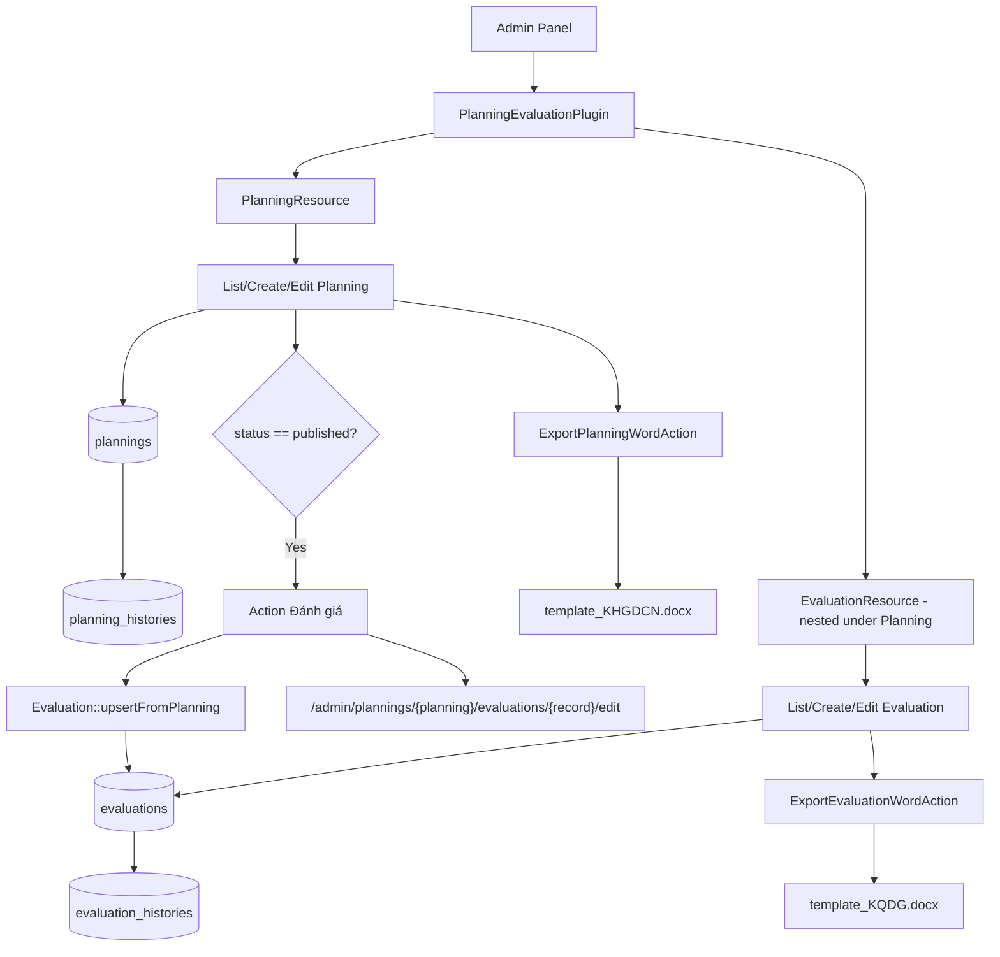
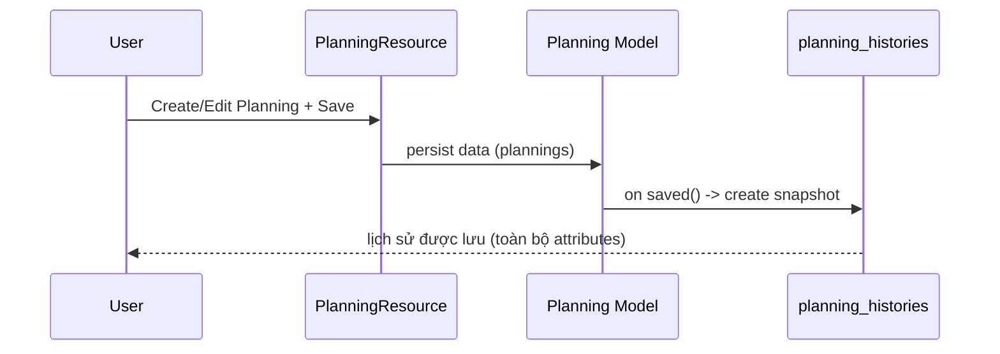
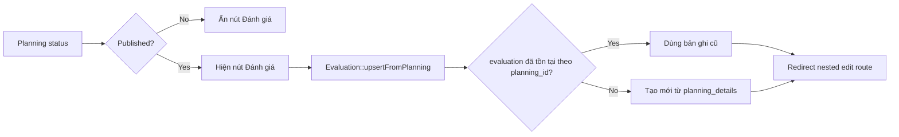
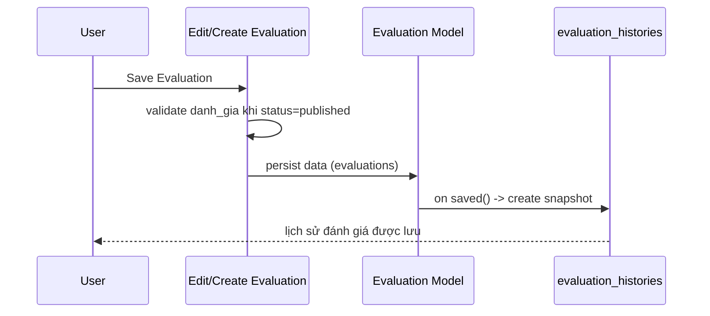

# Planning Evaluation Plugin - Flow hoạt động

## 1) Tổng quan kiến trúc



## 2) Điểm vào plugin

- `PlanningEvaluationPlugin` đăng ký 2 resource: Planning và Evaluation.
- `EvaluationResource` được khai báo `parentResource = PlanningResource`, vì vậy route evaluation là nested theo planning.
- ServiceProvider load migration từ package để các bảng của plugin được migrate cùng hệ thống.

## 3) Luồng nghiệp vụ chính

### 3.1 Quản lý kế hoạch (Planning)



Phân tích:

1. User thao tác ở List/Create/Edit Planning.
2. Save thành công vào bảng `plannings`.
3. Trong `Planning::booted()->saved(...)`, plugin tự tạo 1 bản ghi mới ở `planning_histories`.
4. `snapshot` là toàn bộ `attributesToArray()` tại thời điểm lưu, `saved_by` lấy từ user đăng nhập.

---

### 3.2 Từ Planning sang Evaluation



Phân tích:

- Nút `Đánh giá` chỉ hiển thị khi Planning có `status = published`.
- `upsertFromPlanning()` dùng `firstOrCreate(planning_id)` để đảm bảo 1 planning có tối đa 1 evaluation.
- Dữ liệu `planning_details` được map sang `evaluation_details`:
  - `linh_vuc` -> chuỗi text
  - `muc_tieu` -> danh sách mục tiêu với `danh_gia = null`, `nhan_xet = null`

---

### 3.3 Quản lý đánh giá (Evaluation)



Phân tích:

1. Trước khi lưu, nếu `status = published` thì mọi `danh_gia` trong `evaluation_details.*.muc_tieu.*` đều bắt buộc.
2. Lưu thành công vào `evaluations`.
3. Trong `Evaluation::booted()->saved(...)`, tự ghi snapshot vào `evaluation_histories`.

## 4) Route và breadcrumb

Route nested chính:

- `admin/plannings/{planning}/evaluations`
- `admin/plannings/{planning}/evaluations/create`
- `admin/plannings/{planning}/evaluations/{record}/edit`

Ý nghĩa:

- Evaluation luôn được đặt trong context của 1 Planning.
- Breadcrumb có thể dẫn theo luồng: `Kế hoạch > [Planning cụ thể] > Đánh giá > Chỉnh sửa`.

## 5) Luồng export Word

### 5.1 Export kế hoạch

- Action: `ExportPlanningWordAction`
- Template: `template_KHGDCN.docx`
- Output: file `.docx` trong `storage/app/exports/plannings`
- Có parse markdown inline để giữ đậm/nghiêng trong ô bảng.

### 5.2 Export đánh giá

- Action: `ExportEvaluationWordAction` (chỉ hiện khi evaluation published)
- Template: `template_KQDG.docx`
- Output: file `.docx` trong `storage/app/exports/evaluations`
- Hỗ trợ:
  - map cột đánh giá `+`, `+/-`, `-`
  - merge dọc cột `Lĩnh vực` khi nhiều mục tiêu cùng lĩnh vực
  - parse markdown inline cho `lĩnh vực`, `mục tiêu`, `nhận xét`

## 6) Cấu trúc dữ liệu history

### planning_histories

- `planning_id` (FK -> plannings)
- `snapshot` (JSON toàn bộ attributes planning tại thời điểm save)
- `saved_by` (user id, nullable)
- timestamps

### evaluation_histories

- `evaluation_id` (FK -> evaluations)
- `snapshot` (JSON toàn bộ attributes evaluation tại thời điểm save)
- `saved_by` (user id, nullable)
- timestamps

## 7) Ghi chú vận hành

- Mỗi lần save tạo 1 history record mới (không overwrite).
- Snapshot hiện là raw attributes của model, không embed quan hệ (employee/student/planning relation object).
- Để kích hoạt history tables, cần chạy migrate sau khi pull code:

```bash
php artisan migrate
```
